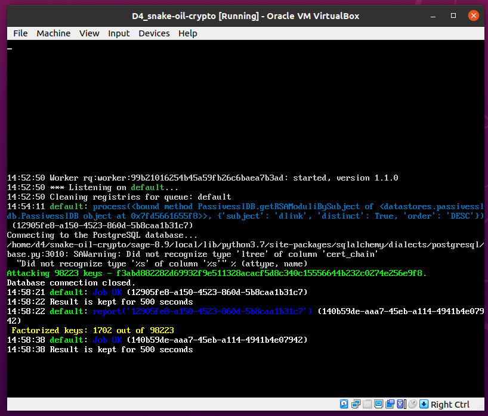
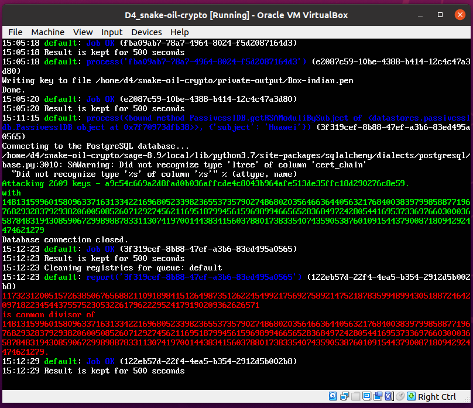
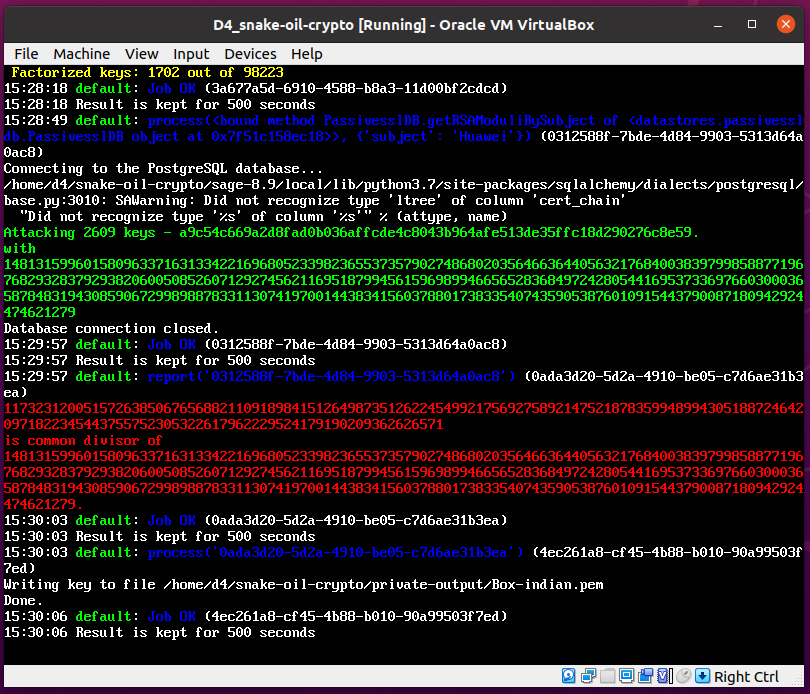

This [virtual machine](D4_snake-oil-crypto.ova.tar.partaa) is used during training to
showcase the use of D4 data collection chain and snake oil crypto project. Its
postgresql DB contains a set of x.509 certificates to play with Batch_GCD
attacks.

Perform the following to get the .ova:
`
cat D4_snake-oil-crypto.ova.tar.parta* > vm.tar
tar -xvf vm.tar
`

Use the user `d4` and password `Password1234` to connect.

# Snake-Oil-Crypto
To launch a SOC worker, `ls` inside the snake-oil-crypto folder then launch:
```bash
./start_screen.sh
```

Inside the screen, one can launch scripts in window1 and results will appear in window2 after a while, for instance:
```bash
sage batch_GCD.py
```


```bash
sage search_modulus_Huawei.py
```


```bash
sage TLS_inspection.py
```

